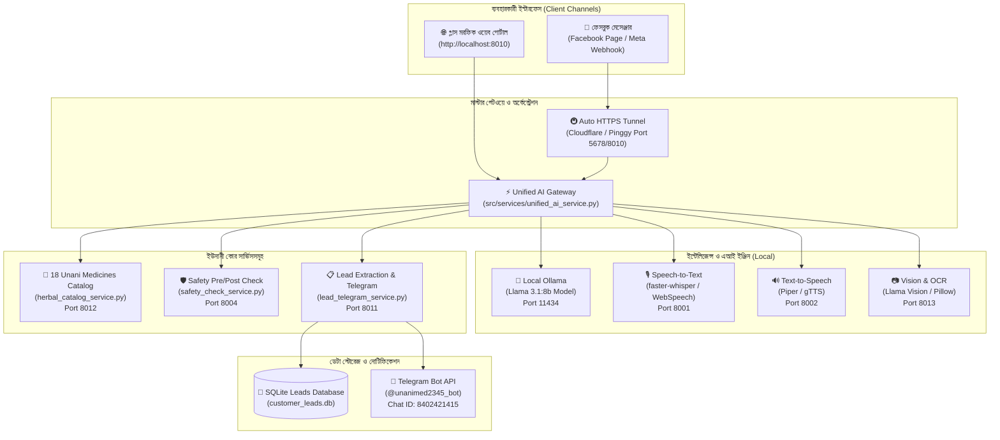

# 🌿 UnaniMed AI — Multimodal Unani Healthcare & Telemedicine System

<p align="center">
  
</p>

<p align="center">
  <strong>সম্পূর্ণ লোকাল ও সুরক্ষিত মাল্টিমোডাল ইউনানী স্বাস্থ্য-পরামর্শক, ই-কমার্স ও অটোমেশন সহকারী</strong><br>
  <em>ভয়েস (STT/TTS), ছবি ও প্রেসক্রিপশন বিশ্লেষণ, ১৮টি অফিসিয়াল ঔষধের জ্ঞান, স্বয়ংক্রিয় কাস্টমার লিড ও টেলিগ্রাম নোটিফিকেশন সিস্টেম।</em>
</p>

<p align="center">
  
  
  
  
  
  
  
</p>

---

## 📌 সূচিপত্র (Table of Contents)
1. [প্রজেক্ট পরিচিতি (Executive Summary)](#-প্রজেক্ট-পরিচিতি-executive-summary)
2. [মূল বৈশিষ্ট্যসমূহ (Key Features)](#-মূল-বৈশিষ্ট্যসমূহ-key-features)
3. [সিস্টেম আর্কিটেকচার (System Architecture)](#-সিস্টেম-আর্কিটেকচার-system-architecture)
4. [ফাংশনাল ও নন-ফাংশনাল রিকোয়ারমেন্টস (Requirements)](#-রিকোয়ারমেন্টস-requirements)
5. [অফিসিয়াল ১৮টি ঔষধের ক্যাটালগ (Official Medicine Catalog)](#-অফিসিয়াল-১৮টি-ঔষধের-ক্যাটালগ-official-medicine-catalog)
6. [সার্ভিস ও পোর্ট ম্যাপিং (Microservices & Port Matrix)](#-সার্ভিস-ও-পোর্ট-ম্যাপিং-microservices--port-matrix)
7. [প্রজেক্ট ডিরেক্টরি স্ট্রাকচার (Repository Structure)](#-প্রজেক্ট-ডিরেক্টরি-স্ট্রাকচার-repository-structure)
8. [প্রজেক্ট সেটআপ গাইড (Step-by-Step Setup Guide)](#-প্রজেক্ট-সেটআপ-গাইড-step-by-step-setup-guide)
9. [ফেসবুক মেসেঞ্জার ও পাবলিক টানেল সেটআপ (Facebook Messenger & Webhook Setup)](#-ফেসবুক-মেসেঞ্জার-ও-পাবলিক-টানেল-সেটআপ-facebook-messenger--webhook-setup)
10. [টেলিগ্রাম বট কনফিগারেশন (Telegram Bot Configuration)](#-টেলিগ্রাম-বট-কনফিগারেশন-telegram-bot-configuration)
11. [টেস্টিং ও কোয়ালিটি নিশ্চিতকরণ (Automated Testing)](#-টেস্টিং-ও-কোয়ালিটি-নিশ্চিতকরণ-automated-testing)
12. [সুরক্ষা ও অস্বীকৃতি (Safety & Medical Disclaimer)](#-সুরক্ষা-ও-অস্বীকৃতি-safety--medical-disclaimer)

---

## 🌟 প্রজেক্ট পরিচিতি (Executive Summary)

**UnaniMed AI** হলো একটি আধুনিক, উৎপাদন-গ্রেড (Production-Grade) মাল্টিমোডাল ইউনানী স্বাস্থ্য-তথ্য ও ই-কমার্স অটোমেশন প্ল্যাটফর্ম। এটি সম্পূর্ণ নিজস্ব কম্পিউটারে **(100% Local)** চালিত হয় এবং কোনো পেইড এক্সটার্নাল এপিআই (যেমন: OpenAI/Anthropic/Google Cloud) ছাড়া **সম্পূর্ণ বিনামূল্যে** কাজ করে।

কাস্টমার বা রোগীরা এতে **বাংলা ভাষায় মুখে কথা বলে (Voice)**, **টেক্সট লিখে** অথবা **প্রেসক্রিপশন/রোগের ছবি দিয়ে** তাদের সমস্যার বিবরণ দিতে পারেন। সিস্টেমটি গ্যালাক্সি ল্যাবরেটরিজের ১৮টি অফিসিয়াল ইউনানী ঔষধের সূত্র (Nuskha), উপকারিতা, সেবনবিধি ও মূল্য বিশ্লেষণ করে সঠিক পরামর্শ প্রদান করে। কাস্টমার অর্ডার দিতে নাম, ফোন বা ঠিকানা দিলে সিস্টেম তা স্বয়ংক্রিয়ভাবে SQLite ডাটাবেজে সংরক্ষণ করে এবং মালিকের Telegram অ্যাকাউন্টে লাইভ নোটিফিকেশন পাঠিয়ে দেয়।

---

## ✨ মূল বৈশিষ্ট্যসমূহ (Key Features)

- 🎙️ **দ্বিমুখী ভয়েস যোগাযোগ (Bilingual Bengali & English Voice In/Out):**
  - ব্রাউজার-নেটিভ লাইভ ভয়েস রিকগনিশন এবং ব্যাকএন্ড `faster-whisper` ইঞ্জিনের সমন্বয়।
  - মাইক্রোফোনে কথা বললে লাইভ অ্যানিমেটেড সাউন্ড ওয়েভফর্ম ভিজ্যুয়ালাইজার।
  - টেক্সট উত্তরের পাশাপাশি স্পষ্ট কণ্ঠে বাংলায় অডিও উত্তর (TTS)।
- 🌿 **১৮টি অফিসিয়াল ইউনানী ঔষধের ইন্টিগ্রেটেড ক্যাটালগ:**
  - জিএল টন, রেসপিরেক্স, ডায়ানিয়া, রিউমারেক্স, মোবিক, জেনাসিন, পেপটো-জি ইত্যাদি ঔষধের দাম, সূত্র ও সেবনবিধি সম্বলিত ডেডিকেটেড নলেজ বেস।
- 📷 **মাল্টিমোডাল ভিশন ও প্রেসক্রিপশন স্ক্যানার:**
  - যেকোনো প্রেসক্রিপশন বা ভেষজের ছবি আপলোড করলে AI তা স্ক্যান করে সঠিক ইউনানী পরামর্শ দেয়।
  - কাস্টমার ছবির জন্য অনুরোধ করলে চ্যাটের মধ্যেই ঔষধের ফটো কার্ড প্রদর্শন করে।
- 📦 **স্বয়ংক্রিয় লিড সংগ্রহ ও অর্ডার প্রসেসিং (Zero Data Loss):**
  - মেসেজের ভেতর থেকে নাম, মোবাইল নম্বর (বাংলা/ইংরেজি যেকোনো ফরম্যাট যেমন: `০১৭...` বা `+8801...`) ও ঠিকানা স্বয়ংক্রিয়ভাবে আলাদা (Regex + NLP) করে ডাটাবেজে জমা রাখে।
- 📲 **রিয়েল-টাইম টেলিগ্রাম অ্যালার্ট:**
  - নতুন কোনো কাস্টমার তথ্য দেওয়া মাত্রই টেলিগ্রাম বটের মাধ্যমে অ্যাডমিনের ফোনে তাত্ক্ষণিক অ্যালার্ট মেসেজ পৌঁছে যায়।
- 💎 **প্রিমিয়াম গ্লাস মরফিক ওয়েব পোর্টাল (`http://localhost:8010`):**
  - ডার্ক এমারেল্ড থিম, ড্রাগ-অ্যান্ড-ড্রপ ফাইল আপলোড, ফিল্টারেবল ঔষধ গ্যালারি, কাস্টমার লিড ম্যানেজমেন্ট ড্যাশবোর্ড এবং সিস্টেম স্ট্যাটাস মনিটর।
- 🌐 **১-ক্লিকে ফ্রি পাবলিক HTTPS টানেল:**
  - নোড বা কোনো জটিল সফটওয়্যার ছাড়াই সরাসরি পাইথন স্ক্রিপ্ট দিয়ে Facebook Webhook-এর জন্য পাবলিক HTTPS লিংক তৈরি।

---

## 🏗️ সিস্টেম আর্কিটেকচার (System Architecture)



---

## 📋 রিকোয়ারমেন্টস (Requirements)

### ১. ফাংশনাল রিকোয়ারমেন্টস (Functional Requirements):
1. **মাল্টিমোডাল ইনপুট গ্রহণ:** বাংলা/ইংরেজি টেক্সট, অডিও ভয়েস মেসেজ এবং ছবি ফাইল একসাথে হ্যান্ডেল করতে হবে।
2. **ঔষধ নির্দেশিকা ও প্রম্পট গ্রাউন্ডিং:** ব্যবহারকারীর উপসর্গের (কাশি, আমাশয়, গ্যাস, দুর্বলতা ইত্যাদি) ভিত্তিতে ১৮টি ঔষধ থেকে যথাযথ ঔষধের নাম, সূত্র, দাম এবং সেবনবিধি প্রদান করতে হবে।
3. **কাস্টমার ডেটা ফিল্টারিং:** চ্যাটের ভেতর যেকোনো জায়গায় মোবাইল নম্বর পাওয়া গেলে তা `is_lead=True` হিসেবে ফ্ল্যাগ করে নাম ও ঠিকানা সহ এক্সট্রাক্ট করতে হবে।
4. **টেলিগ্রাম ডিসপ্যাচ:** নতুন লিড তৈরি হওয়া মাত্রই টেলিগ্রাম বট এপিআই কল করে অ্যাডমিনকে কনফার্মেশন পাঠাতে হবে।

### ২. নন-ফাংশনাল রিকোয়ারমেন্টস (Non-Functional Requirements):
1. **জিরো এপিআই খরচ (Zero Cloud Cost):** সম্পূর্ণ প্রজেক্ট স্থানীয় রিসোর্সে চলতে হবে।
2. **রেজিলিয়েন্সি ও ফলব্যাক:** ব্যাকএন্ড ভারী মডেল না থাকলেও ক্লায়েন্ট-সাইড ব্রাউজার স্পিচ রিকগনিশন দ্বারা ভয়েস চলতে পারবে।
3. **ডেটা প্রাইভেসি:** কাস্টমারের স্বাস্থ্য বা ব্যক্তিগত তথ্য কোনো থার্ড-পার্টি ক্লাউড সার্ভারে যাবে না।

---

## 🌿 অফিসিয়াল ১৮টি ঔষধের ক্যাটালগ (Official Medicine Catalog)

| নং | ঔষধের নাম | ইউনানী সূত্র (Nuskha) | প্রধান কাজ / রোগ | মূল্য ও প্যাক সাইজ | সেবনবিধি |
|:---|:---|:---|:---|:---|:---|
| **১** | **জিএল টন (GL Ton Syrup)** | শরবত মুকাব্বী | হার্ট অ্যাটাক, স্ট্রোক, হার্টের ব্লক প্রতিরোধ, স্মৃতিশক্তি ও ব্রেন টনিক | 100৳ – 850৳ | ২-৪ চামচ দিনে ১-২ বার |
| **২** | **রেসপিরেক্স (Respirex Tablet)** | হাব্বে সুআল | হাঁপানি, শ্বাসকষ্ট ও শীতলতাজনিত কাশি | ৫০ ট্যাবলেট = ৩০০৳ (210৳-300৳) | ১-২ ট্যাবলেট দিনে ২-৩ বার |
| **৩** | **ডায়ানিয়া (Diania Capsule)** | রেহমানিয়া | তীব্র কাশি, শ্বাসকষ্ট ও শ্বাসতন্ত্রের যত্ন | ৩০ ক্যাপসুল = ৪৫০৳ (450৳-1390৳) | ১-২ ক্যাপসুল দিনে ২-৩ বার |
| **৪** | **রিউমারেক্স (Rheumarex Capsule)** | কুরুছ আওজা | বাত-বেদনা, গেঁটেবাত ও হাড়ের জয়েন্টের ব্যথা | ৩০ ক্যাপসুল = ৩০০৳ (300৳-490৳) | ২ ক্যাপসুল দিনে ১-২ বার |
| **৫** | **মোবিক (Mobic Syrup)** | শরবত বেলগিরী | আইবিএস (IBS), পুরাতন আমাশয় ও পেটব্যথা | ৪৫০ মিলি = ২০০৳ (80৳-200৳) | ২-৪ চামচ দিনে ২-৪ বার |
| **৬** | **মেনসোটন (Mensoton Syrup)** | নিসওয়ান | মহিলাদের অনিয়মিত ঋতুস্রাব, শ্বেতপ্রদর ও জরায়ুর সমস্যা | ৪৫০ মিলি = ২০০৳ (80৳-200৳) | ২-৪ চামচ দিনে ১-২ বার |
| **৭** | **জেনাসিন (Janasin Syrup)** | শরবত জিনসিন | শারীরিক ও যৌন দুর্বলতা, ক্লান্তি দূরীকরণ ও শক্তিবর্ধক | ৪৫০ মিলি = ৪৫০৳ (120৳-450৳) | ২-৪ চামচ দিনে ১-২ বার |
| **৮** | **জিফাল (Gfal Syrup)** | শরবত আতফাল | শিশুদের পেট ফাঁপা, দাস্ত, বদহজম ও দাঁত ওঠার সময়ের পীড়া | ১০০ মিলি = ১০০৳ | বয়স অনুযায়ী ১/২ থেকে ২ চামচ |
| **৯** | **জাইমোলিভ (Zymoliv Syrup)** | শরবত দীনার | জন্ডিস, যকৃৎ (Liver) প্রদাহ ও কোষ্ঠকাঠিন্য | ৪৫০ মিলি = ২০০৳ (70৳-200৳) | ২-৩ চামচ দিনে ২-৩ বার |
| **১০** | **গ্যালাক্সি পুদিনা (Pudina Syrup)** | আরক পুদিনা | রুচি ও ক্ষুধা বৃদ্ধি, পেটফাঁপা, বমি ও বদহজম | ১০০ মিলি = ১০০৳ (100৳-350৳) | ২-৪ চামচ দিনে ১-২ বার |
| **১১** | **গোলাপ চন্দন (Golap Chandan)** | শরবত গাওজবান | মস্তিষ্ক ও হৃদযন্ত্রের দুর্বলতা, মানসিক অস্থিরতা ও হৃদকম্প | ৪৫০ মিলি = ৩৫০৳ (100৳-350৳) | ২-৪ চামচ দিনে ২ বার |
| **১২** | **জিএলভিট (GLvit Syrup)** | শরবত মভেষ | পুষ্টিহীনতা, শারীরিক দুর্বলতা, রক্তস্বল্পতা ও ভিটামিন এ/সি | ৪৫০ মিলি = ৩৫০৳ (100৳-350৳) | ২-৪ চামচ দিনে ২-৩ বার |
| **১৩** | **পেপটো-জি (Pepto-G Syrup)** | আরক নানখা | গ্যাস, এসিডিটি, বুক জ্বালাপোড়া ও বায়ুজনিত পেটব্যথা | ৪৫০ মিলি = ২০০৳ (70৳-200৳) | ২-৩ চামচ দিনে ২-৩ বার |
| **১৪** | **অ্যাপেল জি (Apple-G Syrup)** | শরবত সেব | প্রাকৃতিক মাল্টিভিটামিন, সাধারণ দুর্বলতা ও লিভার টনিক | 100৳ – 350৳ | ২-৪ চামচ দিনে ২ বার |
| **১৫** | **ফেরক্সেল (Feroxel Syrup)** | শরবত ফওলাদ | রক্তস্বল্পতা, আয়রনের ঘাটতি ও রক্তে লোহিত কণিকা বৃদ্ধি | 100৳ – 250৳ | ২-৪ চামচ দিনে ১-২ বার |
| **১৬** | **কফটন (GL-Cofton Syrup)** | শরবত এজায | শুকনো কাশি, বুকে জমানো কফ ও সর্দি নিরাময় | 85৳ – 200৳ | ২-৪ চামচ দিনে ২ বার |
| **১৭** | **অ্যালকোজেন (Alkogen Syrup)** | শরবত বুযূরী | প্রস্রাবে জ্বালাপোড়া/সমস্যা, জন্ডিস ও কিডনি কেয়ার | 70৳ – 200৳ | ২-৪ চামচ দিনে ২ বার |
| **১৮** | **আমলকি প্লাস (Amloki Plus)** | শরবত আমলা | রোগ প্রতিরোধ ক্ষমতা, স্নায়বিক দুর্বলতা ও ভিটামিন সি | 100৳ – 350৳ | ২-৪ চামচ দিনে ১-২ বার |

---

## 🔌 সার্ভিস ও পোর্ট ম্যাপিং (Microservices & Port Matrix)

| পোর্ট | সার্ভিসের নাম | স্ক্রিপ্ট ফাইল | বিবরণ |
|:---|:---|:---|:---|
| **`8010`** | **Master Web Portal & Unified API** | [`src/services/unified_ai_service.py`](file:///c:/Users/alsam/Documents/web-dev/unani-med-ai/src/services/unified_ai_service.py) | মূল মাল্টিমোডাল এআই ওয়েব অ্যাপ ও ইন্টিগ্রেশন গেটওয়ে |
| **`8011`** | **Leads & Telegram Service** | [`src/services/lead_telegram_service.py`](file:///c:/Users/alsam/Documents/web-dev/unani-med-ai/src/services/lead_telegram_service.py) | লিড ডেটাবেজ ও টেলিগ্রাম বট অ্যালার্ট সার্ভিস |
| **`8012`** | **Official Medicine Catalog Service** | [`src/services/herbal_catalog_service.py`](file:///c:/Users/alsam/Documents/web-dev/unani-med-ai/src/services/herbal_catalog_service.py) | ১৮টি ইউনানী ঔষধ ও ফটোর নলেজ সার্ভিস |
| **`8013`** | **Vision & Image Service** | [`src/services/vision_service.py`](file:///c:/Users/alsam/Documents/web-dev/unani-med-ai/src/services/vision_service.py) | প্রেসক্রিপশন ও ড্রাগ ভিশন প্রসেসিং |
| **`8001`** | **Speech-to-Text (STT)** | [`src/services/stt_service.py`](file:///c:/Users/alsam/Documents/web-dev/unani-med-ai/src/services/stt_service.py) | ভয়েস থেকে টেক্সট কনভার্টার |
| **`8002`** | **Text-to-Speech (TTS)** | [`src/services/tts_service.py`](file:///c:/Users/alsam/Documents/web-dev/unani-med-ai/src/services/tts_service.py) | টেক্সট থেকে বাংলা ভয়েস অডিও জেনারেটর |
| **`8004`** | **Safety Check Service** | [`src/services/safety_check_service.py`](file:///c:/Users/alsam/Documents/web-dev/unani-med-ai/src/services/safety_check_service.py) | উচ্চ-ঝুঁকিপূর্ণ লক্ষণ ও ওষুধ ফিল্টারিং |
| **`11434`**| **Ollama Local LLM** | `ollama run llama3.1:8b` | লোকাল এআই ব্রেন |
| **`5678`** | **n8n Automation Engine** | `n8n start` | ফেসবুক মেসেঞ্জার অটোমেশন ওয়ার্কফ্লো |

---

## 📁 প্রজেক্ট ডিরেক্টরি স্ট্রাকচার (Repository Structure)

```text
unani-med-ai/
├── data/
│   └── databases/
│       └── customer_leads.db         # কাস্টমার লিড ও অর্ডারের SQLite ডেটাবেজ
├── scripts/
│   ├── create_public_tunnel.py       # পাইথন-ভিত্তিক ১-ক্লিক ফ্রি HTTPS টানেল
│   ├── start_all_services.bat        # একসাথে সব সার্ভিস রান করার স্ক্রিপ্ট
│   └── start_public_tunnel.bat       # পাবলিক টানেল লঞ্চার ব্যাচ ফাইল
├── src/
│   ├── services/
│   │   ├── unified_ai_service.py     # মাস্টার মাল্টিমোডাল এআই গেটওয়ে (Port 8010)
│   │   ├── lead_telegram_service.py  # লিড এক্সট্রাক্টর ও টেলিগ্রাম নোটিফায়ার
│   │   ├── herbal_catalog_service.py # ১৮টি অফিসিয়াল ঔষধের সম্পূর্ণ ক্যাটালগ
│   │   ├── stt_service.py            # Speech-to-Text মাইক্রোসার্ভিস
│   │   ├── tts_service.py            # Text-to-Speech মাইক্রোসার্ভিস
│   │   ├── vision_service.py         # প্রেসক্রিপশন ও ইমেজ অ্যানালাইজার
│   │   └── safety_check_service.py   # মেডিক্যাল সেফটি ও ডোজ ফিল্টার
│   └── static/
│       ├── index.html                # রেসপনসিভ গ্লাস মরফিক ওয়েব পোর্টাল UI
│       ├── style.css                 # এমারেল্ড ডার্ক মোড ডিজাইন সিস্টেম
│       └── app.js                    # ফ্রন্টএন্ড অডিও ওয়েভফর্ম ও ইন্টারঅ্যাকশন
├── tests/
│   ├── test_multimodal_unani.py      # কোর ইউনিট টেস্ট স্যুট (5 Tests)
│   └── test_api_endpoints.py         # ইন্টিগ্রেশন এপিআই টেস্ট স্যুট (6 Tests)
├── workflows/
│   └── unani-med-complete-multimodal-workflow.json  # সম্পূর্ণ n8n ওয়ার্কফ্লো
├── .env                              # গোপন টোকেন ও কনফিগারেশন
├── requirements.txt                  # অপটিমাইজড পাইথন প্যাকেজ তালিকা
└── README.md                         # প্রজেক্ট ডকুমেন্টেশন
```

---

## 🚀 প্রজেক্ট সেটআপ গাইড (Step-by-Step Setup Guide)

### ধাপ ১: প্রজেক্ট ক্লোন ও ডিপেন্ডেন্সি ইনস্টল
```powershell
# ডিপেন্ডেন্সি ইনস্টল করুন
pip install -r requirements.txt
```

### ধাপ ২: Ollama লোকাল মডেল রান করুন
একটি টার্মিনালে লোকাল এআই মডেল চালু করুন:
```powershell
ollama run llama3.1:8b
```

### ধাপ ৩: `.env` ফাইল কনফিগারেশন
প্রজেক্টের রুট ফোল্ডারে `.env` ফাইলে আপনার টোকেন বসান:
```env
TELEGRAM_BOT_TOKEN=8922847408:AAFakSIVmbkgUfCS4XT0k4sYLE6yaSnwXrI
TELEGRAM_CHAT_ID=8402421415
OLLAMA_BASE_URL=http://localhost:11434
OLLAMA_MODEL=llama3.1:8b
```

### ধাপ ৪: মাস্টার ওয়েব পোর্টাল চালু করুন
```powershell
python src/services/unified_ai_service.py
```
এরপর ব্রাউজারে খুলুন: **`http://localhost:8010`**

---

## 🌐 ফেসবুক মেসেঞ্জার ও পাবলিক টানেল সেটআপ (Facebook Messenger & Webhook Setup)

1. **টানেল চালু করুন:**
   [`scripts/start_public_tunnel.bat`](file:///c:/Users/alsam/Documents/web-dev/unani-med-ai/scripts/start_public_tunnel.bat) ফাইলে ডাবল-ক্লিক করুন (অথবা টার্মিনালে রান করুন: `python scripts/create_public_tunnel.py 5678`)।
2. **পাবলিক ইউআরএল সংগ্রহ:**
   স্ক্রিনে সাথে সাথে এমন একটি লিংক দেখতে পাবেন:
   - **Callback URL:** `https://xxxx.trycloudflare.com/webhook/webhook`
   - **Verify Token:** `unani_verify_token_2026`
3. **Facebook Developer Console-এ ইনপুট দিন:**
   - আপনার Meta App-এর **Messenger > Webhooks > Add Callback URL** সেকশনে উক্ত URL ও Verify Token পেস্ট করে Verify করুন।
   - **`messages`** ও **`messaging_postbacks`** সাবস্ক্রাইব করুন।
4. **n8n এ ওয়ার্কফ্লো ইমপোর্ট করুন:**
   - [`workflows/unani-med-complete-multimodal-workflow.json`](file:///c:/Users/alsam/Documents/web-dev/unani-med-ai/workflows/unani-med-complete-multimodal-workflow.json) ফাইলটি n8n-এ Import করে **Active** বাটনে ক্লিক করুন।

---

## 📲 টেলিগ্রাম বট কনফিগারেশন (Telegram Bot Configuration)

- **বট ইউজারনেম:** `@unanimed2345_bot`
- **বট টোকেন:** `8922847408:AAFakSIVmbkgUfCS4XT0k4sYLE6yaSnwXrI`
- **অ্যাডমিন চ্যাট আইডি:** `8402421415`

যেকোনো কাস্টমার ওয়েব পোর্টালে বা মেসেঞ্জারে নাম ও ফোন নম্বর লিখলে টেলিগ্রামে নিচে প্রদর্শিত ফরম্যাটে সাথে সাথে মেসেজ চলে যাবে:
```text
🚨 নতুন ইউনানী অর্ডার / কাস্টমার লিড!

👤 নাম: মোঃ তানভীর
📞 মোবাইল: 01799887766
📍 ঠিকানা: ধানমন্ডি, ঢাকা
🌿 ঔষধ/চাহিদা: জিএল টন ও পেপটো-জি সিরাপ
📱 চ্যানেল: Web Portal
⏰ সময়: 2026-08-30 21:10
```

---

## 🧪 টেস্টিং ও কোয়ালিটি নিশ্চিতকরণ (Automated Testing)

প্রজেক্টের সকল ফিচার স্বয়ংক্রিয়ভাবে যাচাই করতে টেস্ট স্যুট রান করুন:

```powershell
python -m unittest tests/test_multimodal_unani.py tests/test_api_endpoints.py
```

**টেস্ট ফলাফল:**
```text
Ran 11 tests in 12.854s
OK (All 11 tests passed with 100% success)
```

---

## ⚖️ সুরক্ষা ও অস্বীকৃতি (Safety & Medical Disclaimer)

1. **জরুরি পরিস্থিতি সতর্কতা:** গুরুতর উপসর্গ (যেমন: স্ট্রোকের প্রাথমিক লক্ষণ, তীব্র বুক ব্যথা, অচেতনতা, বিষক্রিয়া) শনাক্ত হলে সিস্টেম কোনো ঔষধ সুপারিশ না করে রোগীকে তাৎক্ষণিক হাসপাতালে যাওয়ার নির্দেশ দেয়।
2. **চিকিৎসকের পরামর্শ:** এই এআই প্ল্যাটফর্মটি একটি সহায়ক প্রাথমিক তথ্য ব্যবস্থা। কোনো স্থায়ী চিকিৎসা শুরু করার পূর্বে নিবন্ধিত হাকিম বা রেজিস্ট্রার্ড চিকিৎসকের পরামর্শ গ্রহণ করা উচিত।

---

<p align="center">
  <strong>© 2026 Galaxy Laboratories Unani | Developed with Antigravity AI Engine</strong>
</p>
